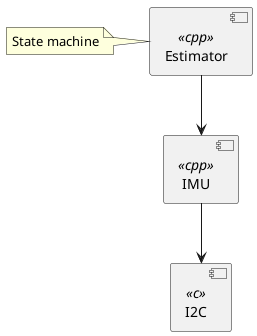

# Mark3 - Block diagram

```plantuml
@startuml

component "Estimator" <<cpp>> as estimator
note left of estimator
  State machine
end note
component "IMU" <<cpp>> as imu
component I2C <<c>> as i2c

estimator --> imu
imu --> i2c

@enduml
```
